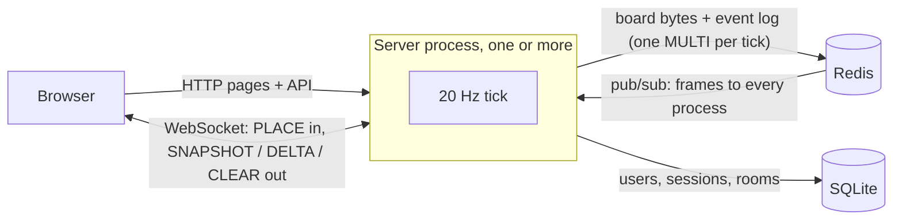

# pixel-canvas
**Access at →** https://pixel-canvas.up.railway.app/

Paint & Guess Together - a shared pixel canvas: everyone on a board paints together in real time over WebSockets.
Binary wire protocol, 20 Hz batched updates, several server processes kept in step through
Redis pub/sub, and an append-only event log that every board can be rebuilt from.

- **Paint together** (`main`): a 16×16 board anyone can paint on, no account needed.
- **Paint with friends** (rooms): log in to make one (up to 512×512), public or private with a join code.
- **Paint and guess with friends** (game rooms, `/guess`): one team paints, the other guesses.
  Everyone picks a team and presses Ready; a painter picks how many rounds and a theme, and
  Claude makes one word per round (plus spares, so a painter can skip a word). Only
  painters see the word and only painters can paint. An exact guess - ignoring case,
  spaces and punctuation - wins the round; anything else waits for a painter's PASS or Not.
  90 seconds a round; the score is words guessed.
- **Lobby**: every room as a live thumbnail, one lobby per kind of room.
- Accounts and rooms with no activity for 30 days are deleted. Activity means logging in,
  or the owner painting in their own room.

## How it fits together



Each paint goes into a per-canvas `dirty` map. Every tick (50 ms) the server writes the
board and appends the frame to the log in one Redis transaction, then publishes it. Every
process, including the sender, applies the frame and sends one DELTA per canvas to its
clients. The browser draws your own pixels immediately; the DELTA confirms them.

| Where | What |
|---|---|
| `src/client` | `main.ts` canvas page, `game.ts` game panel, `lobby.ts`, `auth.ts` login popup, `render.ts` / `overlay.ts` drawing |
| `src/shared` | `protocols.ts` wire format, `palette.ts` (64 colours in shade ramps; indexes never move, boards store them), validation — used by browser and server |
| `src/server` | `game.ts` the game's rules as one pure function, `gameRoom.ts` game rooms across processes, `words.ts` word lists from Claude, `index.ts` routes + tick, `canvas.ts` in-memory state, `redis.ts` storage + pub/sub, `db.ts` SQLite, `auth.ts`, `export.ts` PNGs, `metrics.ts` |

## Running locally

Needs Node 24 and Redis on `localhost:6379`.

```bash
npm install
npm test
npm run watch:client   # terminal 1: bundles src/client -> public/*.js on save
npm run dev            # terminal 2: server on http://localhost:8000

npm run loadtest                  # 200 bots on main; BOTS, CANVASES, URL, ... to change
npm run rebuild -- main [--write] # rebuild a board from its event log, compare with Redis
```

Two processes behind one address: `npm run dev`, `npm run dev:8001`, `npm run proxy`, then
open http://localhost:8080.


## Storage tiers

| Tier   | Holds | Lost on |
|--------|-------|---------|
| memory | resident canvases, per process | restart — by design |
| Redis  | `canvas:<id>:board` — current board bytes | nothing: **derived**, rebuilt from the log |
| Redis  | `canvas:<id>:events` — every DELTA and CLEAR frame, in order | **source of truth** |
| Redis  | `canvas:<id>:game` — a game room's state, JSON, changed only under `canvas:<id>:game:lock` | nothing worth keeping: a lost game restarts in the lobby |
| SQLite | users, sessions, canvas configs, memberships | — (needs a volume when deployed) |

A clear is logged as one CLEAR frame, never by trimming the log. When a canvas is loaded
and its board key is missing, the board is rebuilt from the log. Stop the server before
`rebuild --write` on a canvas it holds.


## Deploying (Railway)

The `Dockerfile` builds the client and runs the server with `tsx`.

| Variable    | Railway value | Default |
|-------------|---------------|---------|
| `PORT`      | set by Railway | 8000 |
| `REDIS_URL` | `${{Redis.REDIS_URL}}` | `redis://127.0.0.1:6379` (a `/n` suffix picks the database) |
| `DB_PATH`   | `/data/canvas.db`, on a volume mounted at `/data` | `pixel-canvas.db` in the project root |
| `NODE_ENV`  | `production` (set in the image) — turns on the `Secure` cookie | — |
| `ANTHROPIC_API_KEY` | your Claude API key — game words come from Claude Haiku 4.5 | unset: words come from a built-in list and ignore the theme |

Without the volume, every deploy wipes accounts and rooms. Start Redis with
`--appendonly yes`: the event log is only as durable as Redis.


## Wire protocol

All multi-byte integers are little-endian. Every message begins with a u8 type tag.
Type ids 4 (REJECTED) and 6 (PRESENCE) are reserved and unused. The event log stores
DELTA and CLEAR frames byte for byte, so these ids are part of the storage format too.

### 1 — PLACE   (client → server)   6 bytes
| offset | type | field  | notes |
|--------|------|--------|-------|
| 0      | u8   | type   | always 1 |
| 1      | u16  | x      | 0..canvas width − 1 |
| 3      | u16  | y      | 0..canvas height − 1 |
| 5      | u8   | colour | palette index 0–63, or 255 (EMPTY) to erase |

x and y are checked against the canvas the socket joined. A connection may burst 10,000
messages and sustain 2,000/s; past that it is closed with 4029.

### 2 — DELTA   (server → client)   3 + 5n bytes
| offset  | type | field  |
|---------|------|--------|
| 0       | u8   | type = 2 |
| 1       | u16  | count = n, at most 65,535 — bigger ticks split across frames |
| 3 + 5i  | u16  | x of pixel i |
| 5 + 5i  | u16  | y of pixel i |
| 7 + 5i  | u8   | colour of pixel i |

### 3 — SNAPSHOT   (server → client)   5 + compressed
| offset | type | field |
|--------|------|-------|
| 0      | u8   | type = 3 |
| 1      | u16  | width |
| 3      | u16  | height |
| 5..    | —    | zlib-deflated board, one byte per pixel |

Sent first on every connection, so a reconnect needs no separate re-sync.

### 5 — CLEAR   (server → client)   1 byte
The whole board is now empty.

### Game messages (game rooms only)
JSON **text** frames on the same socket; pixels stay binary, so neither needs a tag to tell
them apart. Browser → server: `{t:"team", team}`, `{t:"ready", ready}`,
`{t:"theme", theme, rounds}`, `{t:"guess", text}`, `{t:"judge", guessId, pass}`,
`{t:"skip"}`, `{t:"again"}`. Server → browser: `{t:"game", ...}`, the game as that player
may see it (the word only for painters), after every change; or `{t:"error", error}`.
Types in `src/shared/game.ts`. In a game room the server drops PLACE from anyone who is not
a painter in a round.

### Close codes
4001 log in first · 4003 private room · 4004 no such canvas · 4029 too many messages.
The client does not reconnect after these; after anything else it retries with backoff
(1 s doubling to 30 s).
